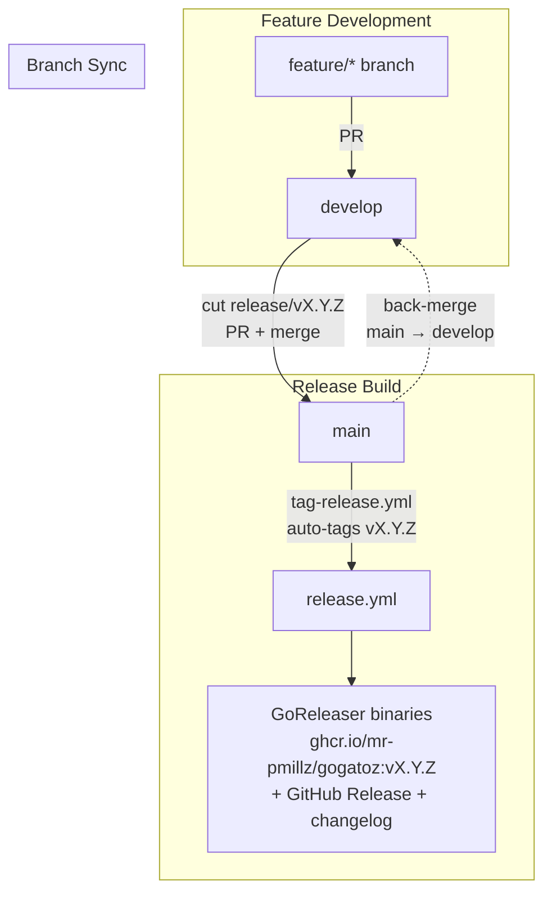
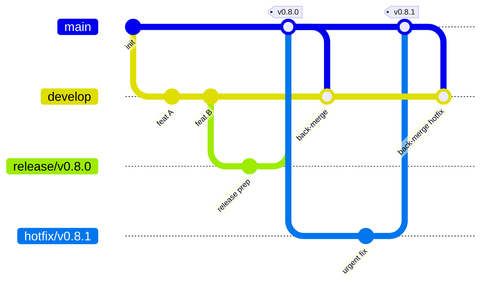
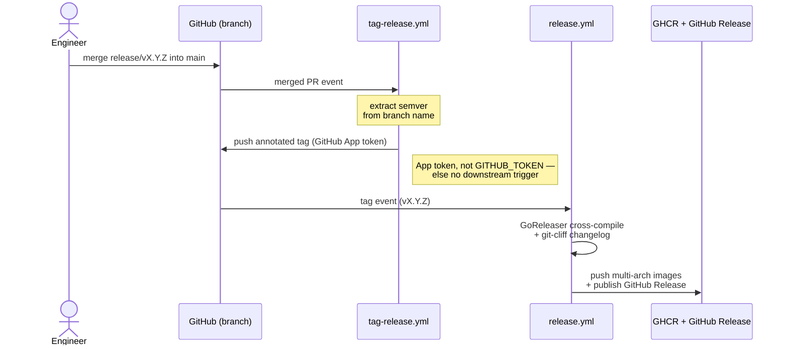

import { Aside, Steps, Tabs, TabItem } from '@astrojs/starlight/components';

GoGatoZ follows a **gitflow** branching model with fully automated releases.
The version number lives in the branch name — there is no version constant to
bump in code.

## Branch Model

| Branch | Cut from | Merges into | Purpose |
|--------|----------|-------------|---------|
| `main` | — | — | Production-ready code. Every commit is releasable; tags live here. |
| `develop` | `main` | `main` (via `release/*`) | Integration branch for the next release. |
| `feature/*`, `fix/*` | `develop` | `develop` | Day-to-day work. |
| `release/vX.Y.Z` | `develop` | `main` **and** `develop` | Stabilise a release. |
| `hotfix/vX.Y.Z` | `main` | `main` **and** `develop` | Urgent production fix. |

### Branch policy enforcement

A `branch-policy.yml` workflow validates every PR:

| Source branch | Allowed target |
|---------------|----------------|
| `feature/*`, `fix/*` | `develop` only |
| `release/*`, `hotfix/*`, `develop` | `main` |
| Any | `develop` |
| Anything else | `main` **blocked** |

## Git Flow

The end-to-end flow — feature work lands on `develop`, a `release/vX.Y.Z`
branch builds the versioned image, and the merge into `main` triggers the
full release automation:



### Branch Topology

How the long-lived (`develop`, `main`) and ephemeral (`release/*`, `hotfix/*`)
branches relate over a release cycle:



### The Auto-Tag Bridge

A branch merge never triggers the release directly. `tag-release.yml` validates
the merged branch, then pushes the annotated tag that `release.yml` consumes —
using the **GitHub App token**, because a tag pushed by the default
`GITHUB_TOKEN` would not trigger a downstream workflow:



## Versioning

GoGatoZ does not keep a version constant in source. The version is resolved at
build time from one of three sources (in order):

1. **GoReleaser ldflags** — injected during the release build
   (`cmd.version`, `cmd.commit`, `cmd.date`).
2. **Module build info** — set automatically by `go install github.com/mr-pmillz/gogatoz@vX.Y.Z`.
3. **Fallback** — `dev` / `none` / `unknown` for plain `go build`.

The version is chosen exactly once: when you name the release branch
(`release/v0.8.0`).

## Release Steps

Use the **GitHub UI** / **CLI** toggle in each step to follow whichever path
you prefer — the choice syncs across every step.

<Steps>
1. **Land features on `develop`.** Merge each `feature/*` or `fix/*` PR into
   `develop`. Verify CI is green.

2. **Create the release branch** from `develop`.

   <Tabs syncKey="ui">
     <TabItem label="GitHub UI">
       - Navigate to **Code → Branches → New branch**.
       - Name it `release/v0.8.0`, source from `develop`.
     </TabItem>
     <TabItem label="CLI">
       ```bash
       git checkout develop && git pull origin develop
       git switch -c release/v0.8.0
       git push -u origin release/v0.8.0
       ```
     </TabItem>
   </Tabs>

3. **Stabilise the release branch.** Only release-blocking fixes go on the
   release branch — no new features. CI runs on every push to `release/**`.

   <Aside type="note">
     The `changelog.yml` workflow automatically regenerates `CHANGELOG.md` on
     each push to the release branch, so the changelog lands on `main` as part
     of the release merge — not as a separate post-merge commit that would break
     CI coverage baselines. Wait for the changelog commit before merging.
   </Aside>

4. **Open a PR into `main`** and wait for CI to pass.

   <Tabs syncKey="ui">
     <TabItem label="GitHub UI">
       - **Pull requests → New pull request**: base `main`, compare `release/v0.8.0`.
       - Wait for CI (build, lint, test, branch-policy) to pass.
     </TabItem>
     <TabItem label="CLI">
       ```bash
       gh pr create --base main --head release/v0.8.0 \
         --title "Release v0.8.0" \
         --body "Stabilised release branch for v0.8.0."
       ```
     </TabItem>
   </Tabs>

5. **Merge the PR.** This triggers the full automation chain:

   1. **`tag-release.yml`** detects the merged `release/*` branch, extracts the
      semver from the branch name, and pushes an annotated `v0.8.0` tag using a
      GitHub App token.
   2. **`release.yml`** fires on the new `v*` tag:
      - GoReleaser cross-compiles binaries for Linux, macOS, and Windows
        (amd64 + arm64).
      - Multi-arch container images are pushed to `ghcr.io/mr-pmillz/gogatoz`.
      - `git-cliff` generates release notes from conventional commits.
      - A GitHub Release is published with the binaries and changelog.
      - Build provenance is attested for both archives and container images.

   <Tabs syncKey="ui">
     <TabItem label="GitHub UI">
       Click **Merge pull request** on the release PR.
     </TabItem>
     <TabItem label="CLI">
       ```bash
       gh pr merge --merge release/v0.8.0
       ```
     </TabItem>
   </Tabs>

6. **Back-merge `main` into `develop`.** Sync the changelog commit and any
   release-branch fixes back to `develop`.

   <Tabs syncKey="ui">
     <TabItem label="GitHub UI">
       - **Pull requests → New pull request**: base `develop`, compare `main`.
       - Click **Merge pull request**.
     </TabItem>
     <TabItem label="CLI">
       ```bash
       git checkout develop && git pull origin develop
       git merge origin/main
       git push origin develop
       ```
     </TabItem>
   </Tabs>
</Steps>

<Aside type="caution">
  `CHANGELOG.md` is already on `main` at this point — it was committed to the
  release branch by `changelog.yml` and merged as part of the PR. Do not run
  `git-cliff` manually after the merge.
</Aside>

## Combining Multiple PRs into One Release

When a single release needs to bundle several in-flight feature branches or
open PRs, create the release branch first, then retarget each feature PR so
they all merge into it. The release branch carries the combined work into
`main`.

<Steps>
1. **Create the release branch** from `develop`.

   <Tabs syncKey="ui">
     <TabItem label="GitHub UI">
       **Branches → New branch**: name `release/v0.8.0`, source `develop`.
     </TabItem>
     <TabItem label="CLI">
       ```bash
       git checkout develop && git pull origin develop
       git switch -c release/v0.8.0
       git push -u origin release/v0.8.0
       ```
     </TabItem>
   </Tabs>

2. **Retarget each feature PR's base** from `develop` to `release/v0.8.0`.

   <Tabs syncKey="ui">
     <TabItem label="GitHub UI">
       - For each open PR: open it → click **Edit** (next to the PR title) →
         change the **base** dropdown from `develop` to `release/v0.8.0` →
         **Change base**.
       - For a feature branch with no PR yet: **Pull requests → New pull
         request**, set base `release/v0.8.0`, compare `feature/foo`.
     </TabItem>
     <TabItem label="CLI">
       ```bash
       gh pr edit 123 --base release/v0.8.0
       gh pr edit 124 --base release/v0.8.0

       # For a branch with no PR yet:
       gh pr create --base release/v0.8.0 --head feature/foo \
         --title "feature/foo" --body "Bundled into release/v0.8.0"
       ```
     </TabItem>
   </Tabs>

3. **Merge each PR into the release branch.** Resolve conflicts on
   `release/v0.8.0` as they surface.

   <Tabs syncKey="ui">
     <TabItem label="GitHub UI">
       Click **Merge pull request** on each retargeted PR.
     </TabItem>
     <TabItem label="CLI">
       ```bash
       gh pr merge 123 --merge
       gh pr merge 124 --merge
       ```
     </TabItem>
   </Tabs>

4. **Open the single release PR into `main` and merge it.** This is
   [Release Steps](#release-steps) step 4 onward: the merge triggers
   `tag-release.yml` → `release.yml`.

   <Tabs syncKey="ui">
     <TabItem label="GitHub UI">
       **Pull requests → New pull request**: base `main`, compare
       `release/v0.8.0`; wait for CI, then **Merge pull request**.
     </TabItem>
     <TabItem label="CLI">
       ```bash
       gh pr create --base main --head release/v0.8.0 \
         --title "Release v0.8.0" --body "Release v0.8.0"
       gh pr merge --merge release/v0.8.0
       ```
     </TabItem>
   </Tabs>
</Steps>

## Hotfix Process

For urgent production fixes that cannot wait for the next release:

<Steps>
1. **Create the hotfix branch** from `main`.

   <Tabs syncKey="ui">
     <TabItem label="GitHub UI">
       **Branches → New branch**: name `hotfix/v0.8.1`, source `main`.
     </TabItem>
     <TabItem label="CLI">
       ```bash
       git checkout main && git pull origin main
       git switch -c hotfix/v0.8.1
       ```
     </TabItem>
   </Tabs>

2. **Fix, commit, and push** the hotfix.

   <Tabs syncKey="ui">
     <TabItem label="GitHub UI">
       Edit files directly on the `hotfix/v0.8.1` branch in GitHub, or push
       from your local clone.
     </TabItem>
     <TabItem label="CLI">
       ```bash
       # make your fix, then:
       git add -A && git commit -m "fix: critical issue XYZ"
       git push -u origin hotfix/v0.8.1
       ```
     </TabItem>
   </Tabs>

3. **Open a PR into `main`** and merge it. The same automation chain fires
   (`tag-release.yml` → `release.yml` → changelog → GitHub Release).

   <Tabs syncKey="ui">
     <TabItem label="GitHub UI">
       - **Pull requests → New pull request**: base `main`, compare
         `hotfix/v0.8.1`.
       - Wait for CI, then **Merge pull request**.
     </TabItem>
     <TabItem label="CLI">
       ```bash
       gh pr create --base main --head hotfix/v0.8.1 \
         --title "Hotfix v0.8.1" \
         --body "Fixes critical issue XYZ."
       gh pr merge --merge hotfix/v0.8.1
       ```
     </TabItem>
   </Tabs>

4. **Back-merge `main` into `develop`.**

   <Tabs syncKey="ui">
     <TabItem label="GitHub UI">
       - **Pull requests → New pull request**: base `develop`, compare `main`.
       - Click **Merge pull request**.
     </TabItem>
     <TabItem label="CLI">
       ```bash
       git checkout develop && git pull origin develop
       git merge origin/main
       git push origin develop
       ```
     </TabItem>
   </Tabs>
</Steps>

## Emergency Manual Tag

If the automation fails, you can always tag manually:

```bash
git tag -a v0.8.0 -m "Release v0.8.0"
git push origin v0.8.0
```

This works because `release.yml` triggers on any `v*` tag push regardless of
how it was created.

## CI/CD Workflows

| Workflow | Trigger | Purpose |
|----------|---------|---------|
| `ci.yml` | Push to `main` / `develop` / `release/**` / `hotfix/**`; PR to `main` or `develop` | Build, lint, test, coverage |
| `tag-release.yml` | Merged PR into `main` from `release/v*` or `hotfix/*` | Auto-tag `vX.Y.Z` |
| `changelog.yml` | Push to `release/v*` or `hotfix/v*` | Regenerate `CHANGELOG.md` on the release branch |
| `release.yml` | Tag `v*` | GoReleaser + GHCR images + GitHub Release + attestation |
| `branch-policy.yml` | PR events | Enforce branch targeting rules |
| `docs.yml` | Push to `main` | Build + deploy Astro docs to GitHub Pages |

## One-Time Setup

Before this flow works, the repository needs:

1. **GitHub App** — create a GitHub App with **Contents: write** permission,
   install it on the repository, and add its credentials as repository secrets:
   - `GOGATOZ_APP_ID` — the App's numeric ID.
   - `GOGATOZ_APP_PRIVATE_KEY` — the App's PEM private key.
2. **Branch protection bypass** — add the GitHub App to the branch/tag
   protection bypass list so it can push tags and commits to protected `main`.
3. **Changelog token** — the App token is reused by `git-cliff` to link PRs
   and authors in the changelog.
